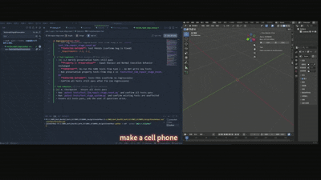

Vibe-Blender-Flow（VBF）
-----------------------------------------------------
## Example
** Make a cellphone

-----------------------------------------------------

通过自然语言驱动 Blender 进行"原子化建模"。核心思想是：
1) Blender 端提供封装好的 High-Level Skills（禁止 LLM 直接操作 bmesh 这类复杂底层）
2) Controller 端用 JSON-RPC 2.0 over WebSocket 调用 Skills，逐步完成建模，并在每一步返回 Success/Error + traceback 用于重试
3) LLM 规划时可获取每个 skill 的完整参数 schema，避免幻觉参数

本仓库包含：
- `/client`：客户端入口（兼容保留，新项目请使用 `/vbf`）
- `/blender_provider`：Blender Addon（8006 WebSocket 监听 + modal timer 每 0.1s 轮询执行队列）与 skills 封装
- `/blender_provider/vbf_addon`：标准 Blender Addon 安装包（可独立复制至 Blender 插件目录）
- `/assets`：保存生成的 `.blend`（预留）
- `/vbf`：对外可复用的 Python 模块（供其它项目 import）

## 运行前置条件

### 客户端环境
- 需要 Python >= 3.10
- 依赖：`websockets`

### Blender 端环境
- Blender 内置 Python 需要具备 `websockets` 依赖
- 在 Blender Python Console 中安装：

```python
import subprocess, sys
subprocess.run([sys.executable, "-m", "pip", "install", "websockets"])
```

## Blender Addon（标准安装方式）

本项目已整理出标准 Addon 包目录：`blender_provider/vbf_addon/`。

### 安装
- 将整个文件夹 `vbf_addon` 复制到你的 Blender 插件目录之一：
  - `<Blender 安装目录>/scripts/addons/vbf_addon`
  - 或你的用户目录 addons 路径（取决于 Blender 配置）
- 打开 Blender：
  - Edit -> Preferences -> Add-ons
  - 搜索 "Vibe-Blender-Flow" 并启用

### 启动服务
- 启用后，在 Blender 的 Python Console 运行：
  - `bpy.ops.vbf.serve()`
- 或使用 N 面板 -> `VBF` 选项卡 -> Start 按钮

### UI 控制
- 3D View -> 右侧 N 面板 -> `VBF` 选项卡
  - Start / Stop 按钮
  - 状态与当前绑定的 host:port 显示
  - Preferences 中可配置 host、port、autostart

## LLM 配置（OpenAI 兼容模式）

如果希望"自然语言 -> skills 参数 + 自动修复重试"由 LLM 完成，需要提供 OpenAI-compatible 的配置。
如果未配置 LLM，本项目会自动退回到可运行的确定性 `RadioTask` demo（不调用外部 API）。

### 方式 A：环境变量（推荐）
- `VBF_LLM_BASE_URL`：例如 `https://api.openai.com/v1`、或 openrouter 提供的 base_url
- `VBF_LLM_API_KEY`
- `VBF_LLM_MODEL`：例如 `gpt-4o-mini` / `qwen2.5-*` / `glm-*` / openrouter 上的模型名
- 可选：
  - `VBF_LLM_TEMPERATURE`（默认 `0.2`）
  - `VBF_LLM_CHAT_COMPLETIONS_PATH`（默认 `/v1/chat/completions`）
  - `VBF_LLM_JSON_OBJECT`（默认 `1`）

### 方式 B：JSON 配置文件
- 默认会读取 `vbf/config/llm.json`（包内相对路径）。
- 你也可以设置 `VBF_LLM_CONFIG_PATH` 指向任意 JSON 文件覆盖默认位置。
- JSON 文件内容示例：

```json
{
  "base_url": "https://api.openai.com/v1",
  "api_key": "YOUR_KEY",
  "model": "gpt-4o-mini",
  "temperature": 0.2,
  "chat_completions_path": "/v1/chat/completions",
  "use_response_format_json_object": true
}
```

## skills_plan / repair_plan schema

`$ref` 引用规则：
- 规范用法：`{"$ref":"<step_id>.data.<key>"}`（与 Blender 返回 `{"ok":..., "data": {...}}` 对齐）
- 兼容别名：`{"$ref":"<step_id>.result.<key>"}` 也会按 `data.<key>` 解析

LLM 生成的 JSON 只包含 skill 名称与 args，不会输出任何 `bpy`/`bmesh` 操作代码；所有 Blender API 封装都在 skill registry 中。

### 可控建模流程（推荐）
为保证建模过程可控，plan 支持以下控制字段：

```json
{
  "controls": {
    "max_steps": 80,
    "allow_low_level_gateway": false,
    "require_ops_introspect_before_invoke": true
  },
  "steps": [
    {
      "step_id": "s1",
      "stage": "discover|blockout|boolean|detail|bevel|normal_fix|accessories|material|finalize",
      "skill": "ops_search",
      "args": { "query": "cube add" }
    }
  ]
}
```

执行器会强制：
- 阶段顺序不能倒退（9 阶段单调递增）：
  `discover → blockout → boolean → detail → bevel → normal_fix → accessories → material → finalize`
- `ops_invoke` 前必须先有对应 `ops_introspect`
- `py_call/py_set` 默认禁用（除非 `allow_low_level_gateway=true`）

### 建模阶段说明

| 阶段 | 说明 |
|---|---|
| `discover` | 探索 API、搜索 operator |
| `blockout` | 基础造型确定（主体形状） |
| `boolean` | 布尔挖洞 / 实体化 |
| `detail` | 细节建模（插口、按钮等） |
| `bevel` | 倒角处理 |
| `normal_fix` | 法线修复 |
| `accessories` | 配件 / 附属件建模（螺纹、线缆等） |
| `material` | 材质赋予 |
| `finalize` | 集合编组、收尾 |

## Skill Schema 注入（LLM 参数感知）

Controller 在规划前会调用 `vbf.describe_skills` RPC，从 Blender 端动态获取每个 skill 的参数 schema（参数名、类型、是否必填、枚举值、返回值结构），并注入到 LLM prompt 中。

这避免了 LLM 只凭名称猜测参数的问题。如果 Blender addon 版本不支持 `vbf.describe_skills`，会自动 fallback 到只传名称列表的旧行为。

## Blender 可执行文件路径
- 建议设置环境变量：`BLENDER_PATH`
- 默认 fallback：`blender`（假设已加入 PATH）

## WebSocket 地址
- 默认：`127.0.0.1:8006`
- 可通过环境变量覆盖：
  - `VBF_WS_HOST`（默认 `127.0.0.1`）
  - `VBF_WS_PORT`（默认 `8006`）

## 安装

使用 uv（推荐）：

```bash
uv sync
```

不使用 uv：

```bash
pip install websockets
```

## 启动与示例

### 情况 A：Blender 已在运行（Addon 已开启）
- 只需运行 client，会自动连接到 `ws://127.0.0.1:8006`

### 情况 B：Blender 未运行（Controller 自动 headless 启动）
- client 会用 `blender -b -P /blender_provider/start_vbf_blender.py` 启动并等待 WebSocket 可用

### RadioTask demo

```bash
python -m vbf --prompt "复古收音机"
```

成功后，Controller 将依次下发 skills，并在控制台显示每一步的返回（包含错误 traceback）。
如果 LLM 未配置，会自动退回到"确定性的示例任务"（RadioTask），以保证项目可跑通。

## 作为其它项目的调用模块

```python
import asyncio
from vbf import VBFClient

async def main():
    client = VBFClient()
    await client.ensure_connected()
    await client.run_radio_task(prompt="复古收音机")

asyncio.run(main())
```

如果 Blender 尚未运行，`ensure_connected()` 会自动 headless 启动。

## CLI 使用

### 模块方式（无需安装）

```bash
python -m vbf --prompt "做一个复古收音机"
```

### 安装后作为命令

```bash
uv sync
vbf --prompt "做一个复古收音机"
```

可选参数：
- `--host`：覆盖 `VBF_WS_HOST`
- `--port`：覆盖 `VBF_WS_PORT`
- `--blender-path`：覆盖 `BLENDER_PATH`

> 说明：`client/` 目录仅为历史入口与示例保留，新项目请直接使用 `vbf` 包与其 CLI。

## Allowed Skills（当前注册表）

| Skill | 说明 | 关键参数 |
|---|---|---|
| `scene_clear` | 清空场景所有对象 | — |
| `create_primitive` | 创建基础几何体 | `primitive_type`: "cube"\|"cylinder"\|"cone"\|"sphere" |
| `create_beveled_box` | 创建带倒角的盒子 | `name`, `size`, `location`, `bevel_width`, `bevel_segments` |
| `create_nested_cones` | 创建嵌套锥体（天线等） | `name_prefix`, `base_location`, `layers`, `z_jitter` |
| `apply_transform` | 设置对象位置/旋转/缩放 | 至少传一个：`location`/`rotation_euler`/`scale` |
| `spatial_query` | 查询对象包围盒特征点 | `query_type`: "top_center"\|"bottom_center"\|"side_center"\|"center" |
| `move_object_anchor_to_point` | 将对象锚点对齐到目标点 | `anchor_type`（同 spatial_query），`target_point` |
| `boolean_tool` | 布尔运算 | `operation`: "difference"\|"union"\|"intersect" |
| `join_objects` | 合并多个对象 | `object_names`, `new_name`（可选） |
| `delete_object` | 删除对象 | `object_name` |
| `rename_object` | 重命名对象 | `object_name`, `new_name` |
| `create_material_simple` | 创建 PBR 材质 | `base_color`, `roughness`, `metallic` |
| `assign_material` | 将材质赋予对象 | `object_name`, `material_name`, `slot_index` |
| `add_modifier_bevel` | 添加倒角修改器 | `width`, `segments` |
| `add_modifier_subdivision` | 添加细分修改器 | `levels`, `render_levels` |
| `apply_modifier` | 应用修改器 | `modifier_name` |
| `api_validator` | 验证 bpy API 路径是否存在 | `api_path` |
| `ops_search` | 搜索 bpy.ops operator | `query`, `head_limit` |
| `ops_introspect` | 查看 operator 参数元信息 | `operator_id` |
| `ops_invoke` | 调用 bpy.ops operator | `operator_id`, `kwargs` |
| `ops_list` | 枚举所有 operator | `prefix`, `head_limit` |
| `py_get` | 读取任意 bpy 路径（需开启网关） | `path_steps` |
| `py_set` | 写入任意 bpy 路径（需开启网关） | `path_steps`, `value` |
| `py_call` | 调用任意 bpy 可调用对象（需开启网关） | `callable_path_steps`, `kwargs` |
| `types_list` | 枚举 bpy.types | `prefix`, `head_limit` |
| `data_collections_list` | 枚举 bpy.data 集合 | `prefix`, `head_limit` |
